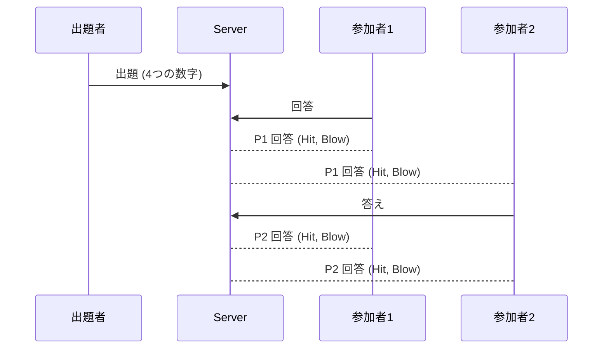

# 設計

## 用語集

- ゲーム(Game): Hit & Blow の一つのお題
  - タイトル(title): ゲームの名前
  - 問題(question): 4桁の数字
  - 出題者(Questioner) = User
    - ゲームに対して一人
  - 参加者(Participant) = User[]
    - ゲームに対して複数
  - 回答(Answer): 参加者 × 結果
    - 結果: ユーザーが送ってきた文字列, Hit, Blow
- ユーザー(User)
  - 名前(name)

## ゲームのコンセプト

- リアルタイムに他の人の回答と結果が見える
- いつでも何回でも回答していい

## 出題からの流れ

## ユースケース

- 問題に入る前にユーザー名が必須
- 問題一覧から問題を選んで参加する
- 問題に対して、4つの数字を入力して回答する
- 問題画面では、他の人の回答と結果がリアルタイムに表示される
- 問題一覧から問題を作成する
